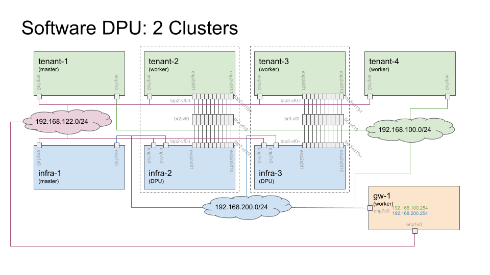

# dpu-software
Notes on setting up a software only DPU testbed using multiple VMs, where some VMs
represent DPUs and others represent the x86 hosts.

## Overview

DPUs can be hard to come by.
This repository documents an attempt to simulate DPU deployments using only software.
Obviously there will be no DPU acceleration, but this DPU deployment is intended to
workout some of the complexities of deploying Kubernetes on DPUs.

In the above diagram, each orange, green and blue box (labeled `gw-1`, `tenant-1`,
`tenant-2`, `infra-1`, etc) is implemented as a VM.
`tenant-2` and `tenant-3` represent the servers hosting DPUs and `infra-2` and `infra-3`
represent the DPUs.
In a typical DPU deployment, VFs are exposed to the server hosting the DPUs and equivalent
VF Representers are exposed to the DPU.
In place of VFs and VF Representers, each VFs and VF Representer is modeled as a TAP
interface with a bridge to tie each pair of TAP interfaces together.
The TAP interfaces are named `tap<X>-vf<Y>-<Z>`, where `<X>` is the Node Number (2 or 3 in
the diagram), `<Y>` is the VF number (0-19), and `<Z>` is the cluster side (`i` for infra
or `t` for tenant).

Each VM has two interfaces.
`enp1s0` is used as a management port.
`enp7s0` is used as a data port and is where all Kubernetes traffic will flow.
The servers hosting the DPUs (`tenant-2` and `tenant-3`), `enp7s0` is removed and all
Kubernetes traffic will flow through the TAP interfaces.

There is a script, [variables.sh](scripts/variables.sh), which contains deployment
variables, such as IP space for infra and tenant clusters, and an array for each
node function with VM hostnames.
To change from the default deployment shown in the diagram, update these arrays.
Default values are:

* `GATEWAY_LIST         = gw-1`
* `INFRA_CTRL_LIST      = infra-1`
* `INFRA_DPU_LIST       = infra-2 infra-3`
* `TENANT_CTRL_LIST     = tenant-1`
* `TENANT_DPU_HOST_LIST = tenant-2 tenant-3`
* `TENANT_WORKER_LIST   = tenant-4`

The scripts are loaded on Remote Server and in `golden-fedora-37` VM early on.
Any changes to default behave should be made in both locations as soon as the
scripts are installed so all scripts use the same values.

## Steps to Deploy

In this example, the VMs are being created and run on a headless server in a remote lab.
Pay attention to where the commands are run.
Some commands are run on the Local Host (like a user's laptop), some commands are run on the
Remote Server, and some commands are run in a given Virtual Machine.

Create the base VM image.

* [Base VM Creation Notes](docs/create-base-vm.md)

Provision Gateway Node:

* [Gateway Node](docs/gateway-node.md)

Install Kubernetes (Container Runtime and Kubernetes) in VM:

* [Install Kubernetes](docs/install-k8s.md)

Install CNI in VM, one of (only one choice for now):

* [Install OVN-Kubernetes](docs/install-ovnk.md)

Create Remaining VMs for Infra and Tenant Clusters:

* [Create Remaining VMs](docs/create-remaining-vms.md)

Configure CNI Networking:

* [Configure OVN-Kubernetes Networking](docs/config-ovnk.md)

Start and Configure Kubernetes:

* [Launch Kubernetes with CNI OVN-Kubernetes](docs/launch-k8s-ovnk.md)

## Status

This project is not complete.
Below are the items that still need to be completed:

* On DPUs (`infra-2` and `infra-3`), plumb VF0 (`tapx-vf0-i`) into OvS.
* Figure out how to plumb TAPs into OVN-Kubernetes
* Update docs to deploy OVN-Kubernetes in different modes.
