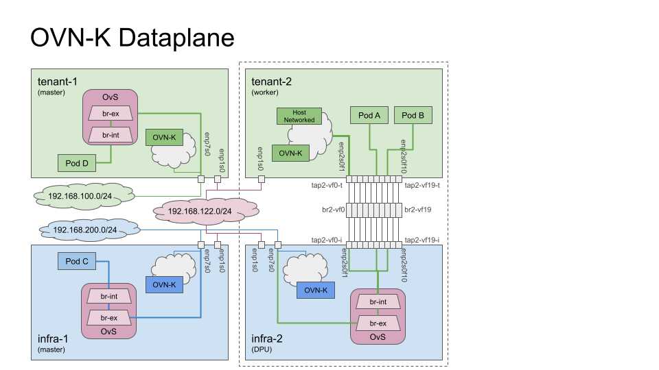

# Configure OVN-Kubernetes Networking

OVN-Kubernetes 




## Configure VM Networking

To configure OvS to be used with OVN-Kubernetes, the following guide was used:
* https://github.com/ovn-org/ovn-kubernetes/blob/master/docs/INSTALL.KUBEADM.md#configure-networking

The [config-ovnk-network.sh](../scripts/config-ovnk-network.sh) script will configure
OvS and other networking settings for the VM as needed.
Run the script in each of the VMs.
The hostname for all of the VMs is still `infra-1`, so the VM name will need to be
passed to the script so the hostname can be set.

### Configure `infra-1`

> Virtual Machine `infra-1` Commands: BEGIN

Log into `infra-1` VM and run the following:

```console
cd ${WORKING_DIR}/dpu-software/
sudo ./scripts/config-ovnk-network.sh infra-1
```

**Summary:**
As a summary, the script above performs the following:

* Set hostname.
* Rename all the "Wired connection x" interfaces, which is the second interface.
* Create the relevant OvS interfaces and bridge `br-ext` for OvS.
* Rename the second interface (`enp7s0`) and attach it to `br-ext`.
* Set the IP address on `br-ext` and configures the routing.
* Configure DNS.

Make sure the system is configured properly:

```console
$ ip route
default via 192.168.200.254 dev br-ex proto static metric 50 
192.168.122.0/24 dev enp1s0 proto kernel scope link src 192.168.122.193 metric 100 
192.168.200.0/24 dev br-ex proto kernel scope link src 192.168.200.1 metric 50 

$ sudo ovs-vsctl show
7c1b494b-0d35-4e7b-b605-2e2cec31453a
    Bridge br-ex
        Port br-ex
            Interface br-ex
                type: internal
        Port enp7s0
            Interface enp7s0
                type: system
    ovs_version: "2.17.5"

$ sudo nmcli conn
NAME             UUID                                  TYPE           DEVICE 
ovs-if-br-ex     9a690d2e-e92e-4f1c-8842-5bfceaf77295  ovs-interface  br-ex  
enp1s0           d238db6d-f3e2-322d-b6a0-98f0087c2d88  ethernet       enp1s0 
br-ex            c00af4d2-f659-4c1a-b511-f702fb9d3284  ovs-bridge     br-ex  
ovs-if-enp7s0    43e9e29f-5bc3-46e4-aa57-5172a1f5c3f1  ethernet       enp7s0 
ovs-port-br-ex   91b75c65-b962-4c55-b699-2a280c49c1a9  ovs-port       br-ex  
ovs-port-enp7s0  f090b0f7-a541-4833-9f56-374f3284b732  ovs-port       enp7s0 

$ ping -4 -c 1 google.com
PING google.com (142.251.16.100) 56(84) bytes of data.
64 bytes from bl-in-f100.1e100.net (142.251.16.100): icmp_seq=1 ttl=53 time=8.03 ms

--- google.com ping statistics ---
1 packets transmitted, 1 received, 0% packet loss, time 0ms
rtt min/avg/max/mdev = 8.028/8.028/8.028/0.000 ms
```

> Virtual Machine `infra-1` Commands: END

### Configure `infra-2`

> Virtual Machine `infra-2` Commands: BEGIN

Log into `infra-2` VM and run the following:

```console
cd ${WORKING_DIR}/dpu-software/
sudo ./scripts/config-ovnk-network.sh infra-2
```

**Summary:**
As a summary, the script above performs the following:

* Set hostname.
* Rename all the "Wired connection x" interfaces, which are the second interface
  and all the TAP Interfaces.
* Create the relevant OvS interfaces and bridge `br-ext` for OvS.
* Rename the second interface (`enp7s0`) and attach it to `br-ext`.
* Set the IP address on `br-ext` and configures the routing.
* Configure DNS.

Make sure the system is configured properly:

```console
$ ip route
default via 192.168.200.254 dev br-ex proto static metric 50 
192.168.122.0/24 dev enp1s0 proto kernel scope link src 192.168.122.193 metric 100 
192.168.200.0/24 dev br-ex proto kernel scope link src 192.168.200.2 metric 50 

$ sudo ovs-vsctl show
7c1b494b-0d35-4e7b-b605-2e2cec31453a
    Bridge br-ex
        Port enp7s0
            Interface enp7s0
                type: system
        Port br-ex
            Interface br-ex
                type: internal
    ovs_version: "2.17.5"

$ sudo nmcli conn show
NAME             UUID                                  TYPE           DEVICE 
ovs-if-br-ex     9a690d2e-e92e-4f1c-8842-5bfceaf77295  ovs-interface  br-ex  
enp1s0           d238db6d-f3e2-322d-b6a0-98f0087c2d88  ethernet       enp1s0 
br-ex            c00af4d2-f659-4c1a-b511-f702fb9d3284  ovs-bridge     br-ex  
ovs-if-enp7s0    43e9e29f-5bc3-46e4-aa57-5172a1f5c3f1  ethernet       enp7s0 
ovs-port-br-ex   91b75c65-b962-4c55-b699-2a280c49c1a9  ovs-port       br-ex  
ovs-port-enp7s0  f090b0f7-a541-4833-9f56-374f3284b732  ovs-port       enp7s0 
enp2s0f1         0f9dbd64-5e71-3a26-ae1a-0846352ddf78  ethernet       --     
enp2s0f2         18b3021e-ef84-3814-b795-40c36b6042fb  ethernet       --     
enp2s0f3         04eb3e13-1d3b-355c-8f2e-0abd8aeb47f1  ethernet       --     
enp2s0f4         cf2a0d84-6b87-35c7-b4fa-4b538ad90e22  ethernet       --     
enp2s0f5         6882b0ec-be94-3017-b5ef-57603725c086  ethernet       --     
enp2s0f6         bcd2470c-251c-3b52-b27e-afef6c9f68b8  ethernet       --     
enp2s0f7         c34cead5-67cf-362b-8102-01268fd447ed  ethernet       --     
enp3s0f1         3956ce98-8962-38ea-a17e-fd2e5ed07a5f  ethernet       --     
enp3s0f2         155fcf88-ea19-31f6-9894-3f85ba289767  ethernet       --     
enp3s0f3         48e11761-58c9-3118-a4e3-0136be3370ce  ethernet       --     
enp3s0f4         9d2b7e5d-906e-33b4-8ae3-ef24a863bd20  ethernet       --     
enp3s0f5         2baede45-97b2-30f9-b1e3-3e5a9776e1c4  ethernet       --     
enp3s0f6         a0f75ea2-a4c3-3773-89dc-2a1a77841383  ethernet       --     
enp3s0f7         39bf3865-fc91-31d0-a901-9bda44421579  ethernet       --     
enp4s0f1         833f1ce3-2487-337b-8187-20c08ebd97e9  ethernet       --     
enp4s0f2         18edb5f0-12a0-31d9-b079-322bed1ae8d3  ethernet       --     
enp4s0f3         b8073059-8921-3c3b-9054-e65b93559e7b  ethernet       --     
enp4s0f4         5edd9deb-3750-3eeb-9144-785ee8f183c3  ethernet       --     
enp4s0f5         15a1d63e-af9a-31ef-9833-8ee9dc219919  ethernet       --     
enp4s0f6         f3f7099b-e0d9-3375-83da-4aa51191f132  ethernet       --     

$ ping -4 -c 1 google.com
PING google.com (142.251.163.139) 56(84) bytes of data.
64 bytes from wv-in-f139.1e100.net (142.251.163.139): icmp_seq=1 ttl=53 time=7.85 ms

--- google.com ping statistics ---
1 packets transmitted, 1 received, 0% packet loss, time 0ms
rtt min/avg/max/mdev = 7.847/7.847/7.847/0.000 ms
```

> Virtual Machine `infra-2` Commands: END

### Configure `infra-3`

> Virtual Machine `infra-3` Commands: BEGIN

Log into `infra-3` VM and run the following:

```console
cd ${WORKING_DIR}/dpu-software/
sudo ./scripts/config-ovnk-network.sh infra-3
```

Refer to `infra-2` section above, remaining is the same.

> Virtual Machine `infra-3` Commands: BEGIN

### Configure `tenant-1`

> Virtual Machine `tenant-1` Commands: BEGIN

Log into `tenant-1` VM and run the following:

```console
cd ${WORKING_DIR}/dpu-software/
sudo ./scripts/config-ovnk-network.sh tenant-1
```

**Summary:**
As a summary, the script above performs the following:

* Set hostname.
* Rename all the "Wired connection x" interfaces, which is the second interface.
* Create the relevant OvS interfaces and bridge `br-ext` for OvS.
* Rename the second interface (`enp7s0`) and attach it to `br-ext`.
* Set the IP address on `br-ext` and configures the routing.
* Configure DNS.

Make sure the system is configured properly:

```console
$ ip route
default via 192.168.100.254 dev br-ex proto static metric 50 
192.168.100.0/24 dev br-ex proto kernel scope link src 192.168.100.1 metric 50 
192.168.122.0/24 dev enp1s0 proto kernel scope link src 192.168.122.181 metric 100 

$ sudo ovs-vsctl show
77c1b494b-0d35-4e7b-b605-2e2cec31453a
    Bridge br-ex
        Port enp7s0
            Interface enp7s0
                type: system
        Port br-ex
            Interface br-ex
                type: internal
    ovs_version: "2.17.5"

$ sudo nmcli conn
NAME             UUID                                  TYPE           DEVICE 
ovs-if-br-ex     9a690d2e-e92e-4f1c-8842-5bfceaf77295  ovs-interface  br-ex  
enp1s0           d238db6d-f3e2-322d-b6a0-98f0087c2d88  ethernet       enp1s0 
br-ex            c00af4d2-f659-4c1a-b511-f702fb9d3284  ovs-bridge     br-ex  
ovs-if-enp7s0    43e9e29f-5bc3-46e4-aa57-5172a1f5c3f1  ethernet       enp7s0 
ovs-port-br-ex   91b75c65-b962-4c55-b699-2a280c49c1a9  ovs-port       br-ex  
ovs-port-enp7s0  f090b0f7-a541-4833-9f56-374f3284b732  ovs-port       enp7s0 

$ ping -4 -c 1 google.com
PING google.com (142.251.16.100) 56(84) bytes of data.
64 bytes from bl-in-f100.1e100.net (142.251.16.100): icmp_seq=1 ttl=53 time=8.03 ms

--- google.com ping statistics ---
1 packets transmitted, 1 received, 0% packet loss, time 0ms
rtt min/avg/max/mdev = 8.028/8.028/8.028/0.000 ms
```

> Virtual Machine `tenant-1` Commands: BEGIN

### Configure `tenant-2`

> Virtual Machine `tenant-2` Commands: BEGIN

Log into `tenant-2` VM and run the following:

```console
cd ${WORKING_DIR}/dpu-software/
sudo ./scripts/config-ovnk-network.sh tenant-2
```

**Summary:**
As a summary, the script above performs the following:

* Set hostname.
* Rename all the "Wired connection x" interfaces, which are all the TAP Interfaces.
* Set the IP address on VF-0 (`enp2s0f1`) and configures the routing.
* Configure DNS.

Make sure the system is configured properly. The `ping` command will not work until
OVN-Kubernetes is up and running on `infra-2` and VF-0 on `infra-2` is bound into OvS.
 
```console
$ ip route
default via 192.168.100.254 dev enp2s0f1 proto static metric 50 
192.168.100.0/24 dev enp2s0f1 proto kernel scope link src 192.168.100.2 metric 50 
192.168.122.0/24 dev enp1s0 proto kernel scope link src 192.168.122.39 metric 100 

$ sudo nmcli  show
NAME      UUID                                  TYPE      DEVICE   
enp2s0f1  f0046873-0ea4-3ca7-a3fa-10b85d2be988  ethernet  enp2s0f1 
enp1s0    d238db6d-f3e2-322d-b6a0-98f0087c2d88  ethernet  enp1s0   
enp2s0f2  da92550f-1aeb-343d-8abe-76f1d8c053fe  ethernet  --       
enp2s0f3  f16dda1d-83e6-3855-a6b3-9640e3e4f248  ethernet  --       
enp2s0f4  47067692-f2f3-34c4-8e23-9d5a3a93f283  ethernet  --       
enp2s0f5  9a25574e-ecd2-3776-965e-d2ce0a2d83d8  ethernet  --       
enp2s0f6  b81b3d5a-509c-3773-a6eb-d8fc68a77689  ethernet  --       
enp2s0f7  472dcc46-b0e5-387a-8d12-0174884fbb6b  ethernet  --       
enp3s0f1  d7c44fde-9964-39bd-b0fd-035a8bdf7bb5  ethernet  --       
enp3s0f2  0edfc5a4-bac5-3669-b8af-67529c58eba2  ethernet  --       
enp3s0f3  d28b7cd9-0148-3b63-a329-9034dfa99cec  ethernet  --       
enp3s0f4  a1f85402-8f41-3957-815b-6b44c05697a9  ethernet  --       
enp3s0f5  5c533e95-d7ae-3436-8683-d50b3a7cf339  ethernet  --       
enp3s0f6  b104f60c-3958-3c2e-8ad9-de75b23b4e2e  ethernet  --       
enp3s0f7  a2326a4e-d01d-3490-b9b8-8eb6bd88e5d1  ethernet  --       
enp4s0f1  5ac50320-3743-3dcb-842c-ad4f993a1026  ethernet  --       
enp4s0f2  60ab7668-e886-33b7-af8e-659d62ef2996  ethernet  --       
enp4s0f3  17e365db-72b6-382a-9aa9-43c8147112fb  ethernet  --       
enp4s0f4  33c6a362-f984-32ad-870b-2a85ffd46dfa  ethernet  --       
enp4s0f5  2de7019a-da3b-301e-a2e6-80216157c17d  ethernet  --       
enp4s0f6  4e9d3d12-9f72-3643-93f1-46ae0dccf4cd  ethernet  --       
```

> Virtual Machine `tenant-2` Commands: BEGIN

### Configure `tenant-3`

> Virtual Machine `tenant-3` Commands: BEGIN

Log into `tenant-3` VM and run the following:

```console
cd ${WORKING_DIR}/dpu-software/
sudo ./scripts/config-ovnk-network.sh tenant-3
```

Refer to `tenant-2` section above, remaining is the same.

> Virtual Machine `tenant-3` Commands: BEGIN

### Configure `tenant-4`

> Virtual Machine `tenant-4` Commands: BEGIN

Log into `tenant-4` VM and run the following:

```console
cd ${WORKING_DIR}/dpu-software/
sudo ./scripts/config-ovnk-network.sh tenant-4
```

Refer to `tenant-1` section above, remaining is the same.

> Virtual Machine `tenant-3` Commands: BEGIN


--------------------------

VF-0 (`tap<X>-vf0-<Z>`) is special in the way OVN-Kubernetes uses it.
On the tenant side, it binds to the host network so that host traffic get pushed through
the DPU.


## Start Kubernetes

```console
sudo kubeadm init --token-ttl 0 --pod-network-cidr=10.244.0.0/16 --cri-socket=unix:///var/run/containerd/containerd.sock
:
addons] Applied essential addon: CoreDNS
[addons] Applied essential addon: kube-proxy

Your Kubernetes control-plane has initialized successfully!

To start using your cluster, you need to run the following as a regular user:

  mkdir -p $HOME/.kube
  sudo cp -i /etc/kubernetes/admin.conf $HOME/.kube/config
  sudo chown $(id -u):$(id -g) $HOME/.kube/config

Alternatively, if you are the root user, you can run:

  export KUBECONFIG=/etc/kubernetes/admin.conf

You should now deploy a pod network to the cluster.
Run "kubectl apply -f [podnetwork].yaml" with one of the options listed at:
  https://kubernetes.io/docs/concepts/cluster-administration/addons/

Then you can join any number of worker nodes by running the following on each as root:

kubeadm join 192.168.122.70:6443 --token vgp7i3.fn12uc2mztw6gdoj \
	--discovery-token-ca-cert-hash sha256:133a1dce9751e74f63810be1f3238537dd6792926f35214813fcc95098a52726 
```

## Start OVN-Kubernetes

br-int might be added by OVN, but the files for it are not created in `/var/run/openvswitch`.

```console
kubectl logs -n ovn-kubernetes ovnkube-node-2lhq7 -c ovn-controller
:
2023-04-18T21:42:33.907Z|00043|rconn|WARN|unix:/var/run/openvswitch/br-int.mgmt: connection failed (No such file or directory)
2023-04-18T21:42:41.915Z|00044|rconn|WARN|unix:/var/run/openvswitch/br-int.mgmt: connection failed (No such file or directory)
2023-04-18T21:42:41.915Z|00045|rconn|WARN|unix:/var/run/openvswitch/br-int.mgmt: connection failed (No such file or directory)
:
```

The best workaroud is to pre-create br-int before the OVN Kubernetes installation:
```console
sudo ovs-vsctl add-br br-int
```


```console
# Create OVN namespace, service accounts, ovnkube-db headless service, configmap, and policies
kubectl create -f $WORKING_DIR/ovn-kubernetes/dist/yaml/ovn-setup.yaml

# Optionally, if you plan to use the Egress IPs or EgressFirewall features, create the corresponding CRDs:
# create egressips.k8s.ovn.org CRD
kubectl create -f $WORKING_DIR/ovn-kubernetes/dist/yaml/k8s.ovn.org_egressips.yaml
# create egressfirewalls.k8s.ovn.org CRD
kubectl create -f $WORKING_DIR/ovn-kubernetes/dist/yaml/k8s.ovn.org_egressfirewalls.yaml

# Run ovnkube-db deployment.
kubectl create -f $WORKING_DIR/ovn-kubernetes/dist/yaml/ovnkube-db.yaml

# Run ovnkube-master deployment
# To run ovnkube-master deployment with both cluster manager and network controller manager as one container)
kubectl create -f $WORKING_DIR/ovn-kubernetes/dist/yaml/ovnkube-master.yaml

# or to run ovnkube-master deployment with cluster manager and network controller manager as independent containers.
#kubectl create -f $WORKING_DIR/ovn-kubernetes/dist/yaml/ovnkube-cm-ncm.yaml

# Run ovnkube daemonset for nodes
kubectl create -f $WORKING_DIR/ovn-kubernetes/dist/yaml/ovnkube-node.yaml

kubectl delete daemonsets -n kube-system kube-proxy
```


In order to uninstall OVN kubernetes:
```console
kubectl delete -f $WORKING_DIR/ovn-kubernetes/dist/yaml/ovnkube-node.yaml
kubectl delete -f $WORKING_DIR/ovn-kubernetes/dist/yaml/ovnkube-master.yaml
kubectl delete -f $WORKING_DIR/ovn-kubernetes/dist/yaml/ovnkube-db.yaml
kubectl delete -f $WORKING_DIR/ovn-kubernetes/dist/yaml/ovn-setup.yaml
```
